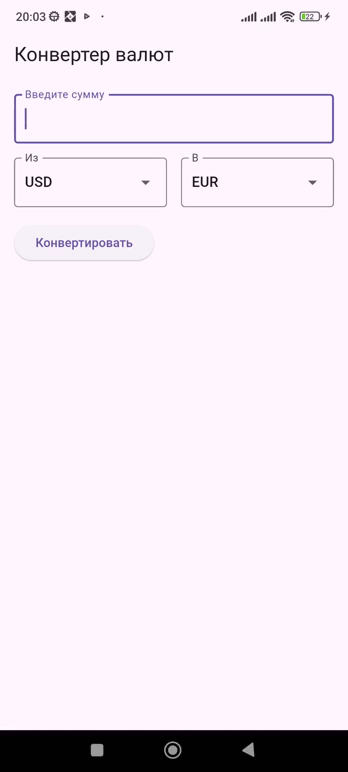

## Конвертор валют
Приложение для конвертации валют.Оно использует API сервиса CurrencyLayer для получения актуальных курсов валют. 
Пользователь может выбирать валюты из списка, вводить сумму для конвертации и получать результат в реальном времени.

## Ключевые особенности
Простое и интуитивное пользовательское интерфейс.

Конвертация между основными мировыми валютами, включая USD, EUR, GBP, JPY, KZT,RUB и др.

Получение актуальных данных о курсах валют через API.

Реализация HTTP-запросов с обработкой ошибок.

## Демонстрация работы приложения

